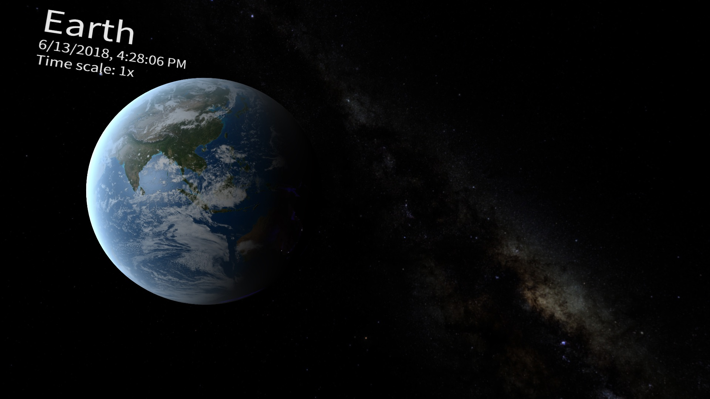
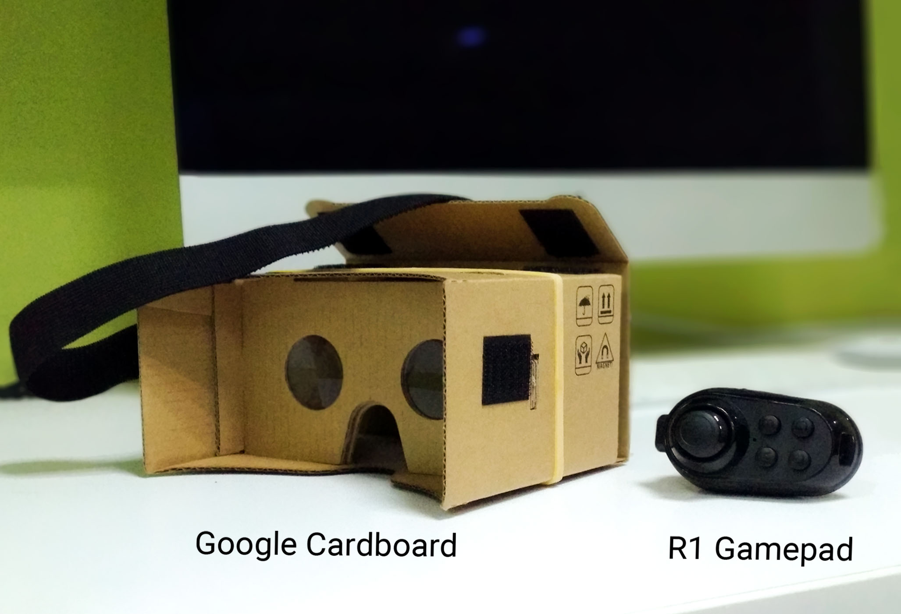
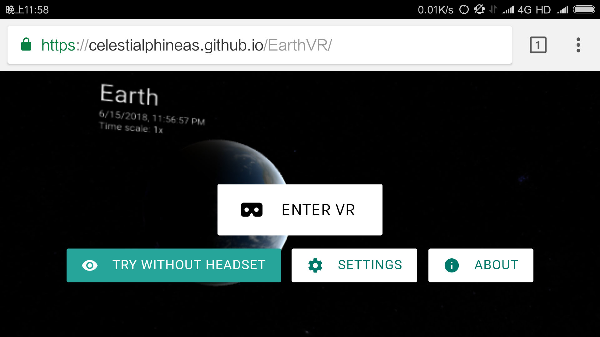
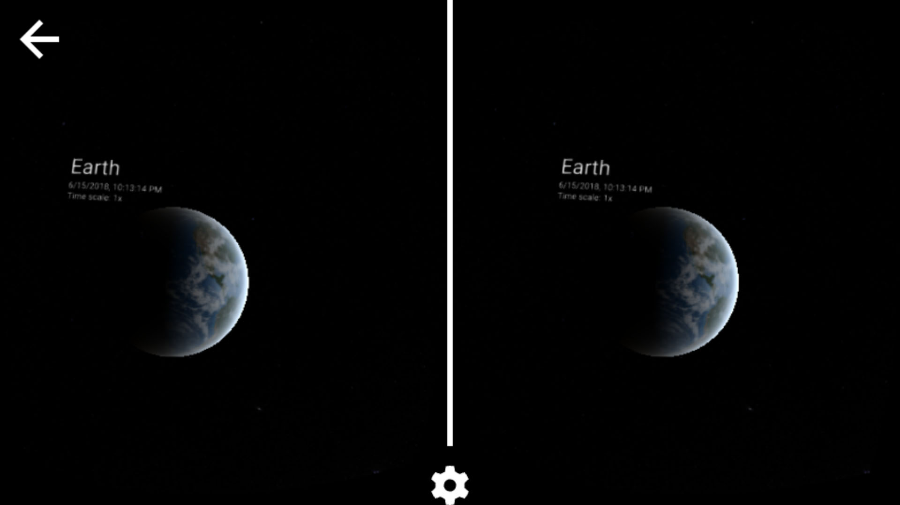

# EarthVR

Example of a VR scene with gamepad controlling support in your browser.

https://celestialphineas.github.io/EarthVR

## VR Experience with Minimal Cost

You'll need to own:
- A smartphone (Everybody here reading this page has one, don't they?)
- Google Cardboard
- R1 Gamepad
- Chrome (since it works best with Chrome. A test on Firefox doesn't work well.)

Without a new smartphone taken into account, the total cost will be no more than 10 US dollars.

## Quick Start

It may take you some time to download the resources during the first start. And you will see a few options on the screen. Note that, when you are viewing at PC, the "Enter VR" button will be disabled, at which time, you may click the "try without headset" button for viewing.

The "Settings" button would allow users to set various parameters, including the visibility of HUD (head-up displays) and manipulation of the time. You can make things faster or slower as you want.

For help info, simply tap the "About" button for a detailed explanation.

If you have a gamepad, keep it connected with the phone. And after entered the VR mode, you may put the phone into your cardboard and enjoy.

## Control

### Joystick Control

EarthVR supports R1 gamepad control.

- **Axis 0 & 1**: Rotating about the earth
- **B5** `⏎` + **Axis 1**: Zooming
- **B3** (sometimes `A`): Faster time
- **B2** (sometimes `C`): Slower time
- **B4** `◯`: Toggling HUD

### Mouse & Keyboard Control

When using a PC, the VR effect will not work. You can simply use your mouse and keyboard to navigate.
- **Left mouse button**: Rotating about axis
- **Right mouse button** and `←` `↑` `↓` `→`: Moving around the scene
- **Mouse wheel**: Zooming

## Credits
- The well-known [jQuery](https://jquery.com/)
- Mr.doob's fantastic WebGL library [three.js](https://threejs.org/)
- Thanks to [WebVR Polyfill](https://github.com/immersive-web/webvr-polyfill) , we can use WebVR without a special browser build
- Dependency of WebVR Polyfill, [ES6-Promise](https://github.com/stefanpenner/es6-promise)
- [Google WebVR UI](https://github.com/googlevr/webvr-ui)
- Simple yet beautiful [Materialize](https://materializecss.com/).css

## Author
Celestial Phineas @ ZJU

## License
MIT
